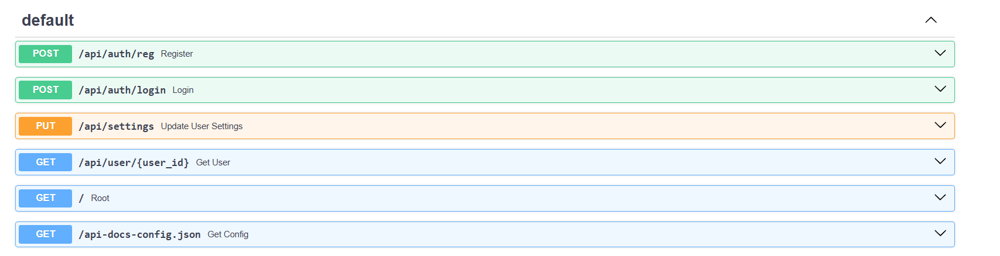
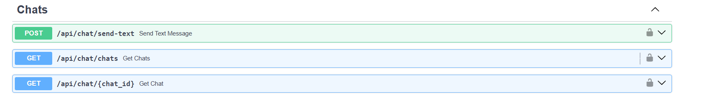
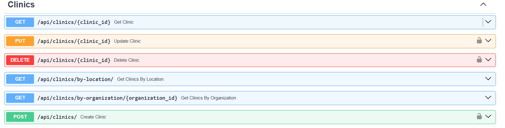
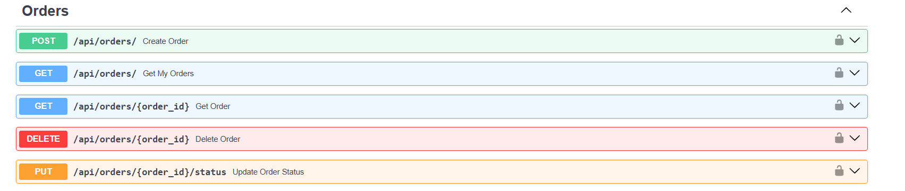
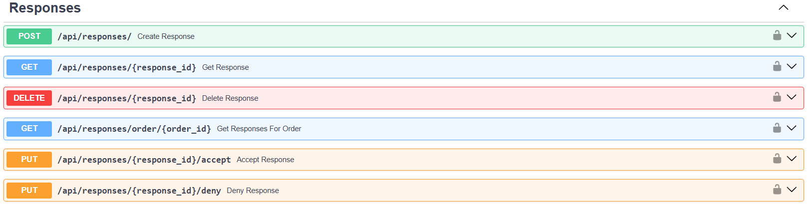
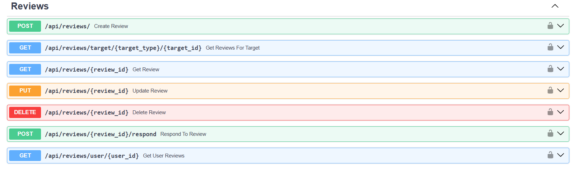
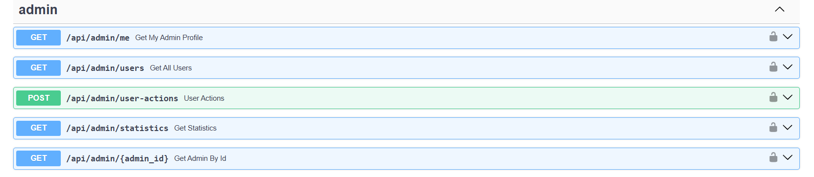
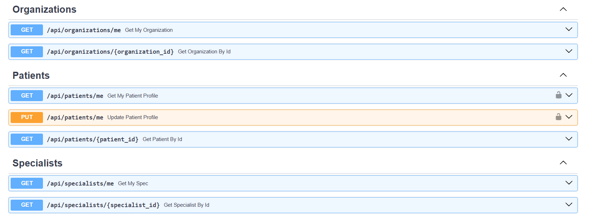

Документация по эндпоинтам API
Аутентификация
Регистрация пользователя
text
POST /api/auth/reg
Content-Type: application/json

{
  "nickname": "user123",
  "name": "John Doe",
  "password": "SecurePass123!",
  "country": "Testland",
  "city": "Test City",
  "email": "user@test.com",
  "role": "patient",
  "phone_number": "+1234567890"
}
Логин
text
POST /api/auth/login
Content-Type: application/json

{
  "nickname": "user123",
  "password": "SecurePass123!"
}
Пользователи
Получить профиль пациента
text
GET /api/patients/me
Authorization: Bearer <token>
Обновить профиль пациента
text
PUT /api/patients/me
Authorization: Bearer <token>
Content-Type: application/json

{
  "city": "New City"
}
Получить профиль специалиста
text
GET /api/specialists/me
Authorization: Bearer <token>
Получить профиль организации
text
GET /api/organizations/me
Authorization: Bearer <token>
Администрирование
Получить всех пользователей
text
GET /api/admin/users
Authorization: Bearer <admin_token>
Действия с пользователями
text
POST /api/admin/user-actions
Authorization: Bearer <admin_token>
Content-Type: application/json

{
  "user_id": 123,
  "action": "block",
  "reason": "Test block"
}
Статистика
text
GET /api/admin/statistics
Authorization: Bearer <admin_token>
Чаты
Отправить сообщение
text
POST /api/chat/send-text
Authorization: Bearer <token>
Content-Type: application/json

{
  "recipient_id": 456,
  "text": "Hello, doctor!"
}
Получить чаты пользователя
text
GET /api/chat/chats
Authorization: Bearer <token>
Получить сообщения чата
text
GET /api/chat/{chat_id}
Authorization: Bearer <token>
Клиники
Создать клинику
text
POST /api/clinics/
Authorization: Bearer <org_token>
Content-Type: application/json

{
  "organization_id": 1,
  "name": "Test Clinic",
  "location": "Test City",
  "address": "123 Test St",
  "work_hours": {},
  "is_24_7": false
}
Получить информацию о клинике
text
GET /api/clinics/{clinic_id}
Обновить клинику
text
PUT /api/clinics/{clinic_id}
Authorization: Bearer <org_token>
Content-Type: application/json

{
  "name": "Updated Clinic",
  "is_24_7": true
}
Удалить клинику
text
DELETE /api/clinics/{clinic_id}
Authorization: Bearer <org_token>
Заказы
Создать заказ
text
POST /api/orders/
Authorization: Bearer <token>
Content-Type: application/json

{
  "service_type": "Consultation",
  "description": "Need help with back pain",
  "preferred_date": "2023-12-31T12:00:00",
  "patient_id": null,
  "clinic_id": null
}
Получить заказы пользователя
text
GET /api/orders/
Authorization: Bearer <token>
Обновить статус заказа
text
PUT /api/orders/{order_id}/status
Authorization: Bearer <token>
Content-Type: application/json

{
  "status": "cancelled"
}
Отклики на заказы
Создать отклик
text
POST /api/responses/
Authorization: Bearer <token>
Content-Type: application/json

{
  "order_id": 123,
  "text": "I can help with your issue"
}
Принять отклик
text
PUT /api/responses/{response_id}/accept
Authorization: Bearer <token>
Отклонить отклик
text
PUT /api/responses/{response_id}/deny
Authorization: Bearer <token>
Удалить отклик
text
DELETE /api/responses/{response_id}
Authorization: Bearer <token>
Отзывы
Создать отзыв
text
POST /api/reviews/
Authorization: Bearer <token>
Content-Type: application/json

{
  "order_id": 123,
  "target_id": 456,
  "target_type": "clinic",
  "text": "Great service and facilities!",
  "rate": 9
}
Ответить на отзыв
text
POST /api/reviews/{review_id}/respond
Authorization: Bearer <token>
Content-Type: application/json

{
  "response": "Thank you for your feedback!"
}
Получить отзывы для цели
text
GET /api/reviews/target/clinic/{target_id}
Authorization: Bearer <token>
Обновить отзыв
text
PUT /api/reviews/{review_id}
Authorization: Bearer <token>
Content-Type: application/json

{
  "text": "Updated review text",
  "rate": 8
}
Удалить отзыв
text
DELETE /api/reviews/{review_id}
Authorization: Bearer <token>
Настройки
Обновить настройки пользователя
text
PUT /api/settings
Authorization: Bearer <token>
Content-Type: application/json

{
  "name": "Updated Name",
  "country": "Updated Country",
  "email": "updated@example.com",
  "password": "new_strong_password_123!"
}